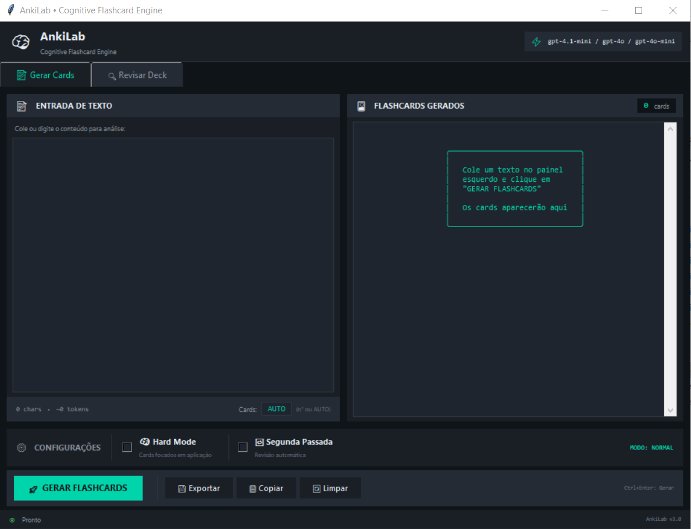

# 🧠 AnkiLab – Cognitive Flashcard Engine

**Autor:** Rubiali
**Status:** Em desenvolvimento ativo 🚧

Gerador inteligente de flashcards para **Anki**, focado em **aprendizado cognitivo**, usando **IA** para criação, refinamento e revisão de cards.

<div align="center">



<sub>Interface principal do AnkiLab</sub>

</div>


---

## 🎯 Objetivo do Projeto

O **AnkiLab** foi criado para resolver um problema comum:

> *gerar flashcards de alta qualidade exige muito tempo e conhecimento pedagógico*.

O projeto automatiza esse processo usando IA, mantendo foco em:

* Clareza conceitual
* Aplicação prática
* Evitar cards vagos ou inúteis
* Compatibilidade total com o Anki

---

## ✨ Funcionalidades

* 🧠 **Geração de Cards** a partir de texto livre
* 🔥 **Modo Hard** (ênfase em aplicação e raciocínio)
* 🔁 **Refinamento** (segunda passada para melhorar qualidade)
* 🧪 **Revisão de Decks** (auditoria e melhoria de cards existentes)
* 📦 **Exportação**:

  * `.apkg` (Anki)
  * `.txt` (Anki / Noji)
* 🎨 **Interface gráfica** (GUI)

---

## 🛠️ Tecnologias Utilizadas

* **Python 3.10+** (recomendado)
* **Poetry** (gerenciamento de dependências)
* **OpenAI API** (IA)
* **Tkinter** (interface gráfica)

---

## 📋 Requisitos

* Python **3.8+** (ideal: 3.10 ou 3.11)
* Poetry instalado
* Chave de API da OpenAI

---

## 📦 Instalação (Poetry)

```bash
# Clone o repositório
git clone https://github.com/seu-usuario/ankilab.git
cd ankilab

# Instale as dependências
poetry install

# Ative o ambiente virtual
poetry shell
```

---

## 🔐 Configuração da API Key

### Linux / macOS

```bash
export OPENAI_API_KEY="sua-chave-aqui"
```

### Windows (PowerShell)

```powershell
setx OPENAI_API_KEY "sua-chave-aqui"
```

> A chave é lida automaticamente em `config/settings.py`.

---

## ▶️ Execução

```bash
poetry run python main.py
```

---

## 📁 Estrutura do Projeto

```text
ankilab/
├── main.py                # Ponto de entrada da aplicação
├── README.md
├── pyproject.toml         # Configuração do Poetry
├── poetry.lock            # Lock de dependências
├── config/
│   ├── __init__.py
│   ├── settings.py        # Variáveis de ambiente e configs globais
│   └── prompts.py         # Prompts utilizados pela IA
├── core/
│   ├── __init__.py
│   ├── api.py             # Comunicação com a OpenAI
│   └── parser.py          # Conversão de texto → flashcards
├── ui/
│   ├── __init__.py
│   ├── app.py             # Inicialização da GUI
│   ├── theme.py           # Tema visual
│   ├── components/
│   │   ├── __init__.py
│   │   └── export_dialog.py
│   └── tabs/
│       ├── __init__.py
│       ├── generate_tab.py
│       └── review_tab.py
├── utils/
│   ├── __init__.py
│   ├── export.py          # Exportação (.apkg, .txt)
│   └── validators.py      # Validações de entrada
```

---

## 🧩 Arquitetura (Visão Geral)

* **core/** → regra de negócio (IA, parsing, lógica)
* **ui/** → interface gráfica (isolada da lógica)
* **config/** → prompts e configurações
* **utils/** → funções auxiliares reutilizáveis

Essa separação evita acoplamento e facilita testes futuros.

---

## 🚧 Pendências Conhecidas / Melhorias Futuras

* [ ] Adicionar testes automatizados
* [ ] Adicionar modo CLI (sem interface gráfica)
* [ ] Suporte a múltiplos modelos de IA
* [ ] Presets de decks por área (ex: programação, línguas, medicina)

---

## 📄 Licença

MIT License

---

## 🤝 Contribuições

Contribuições são bem-vindas.

1. Fork o projeto
2. Crie uma branch (`feature/nome-da-feature`)
3. Commit suas alterações
4. Abra um Pull Request

---

> **Nota final:** Este projeto foi pensado para quem leva aprendizado a sério, não para gerar cards sup
